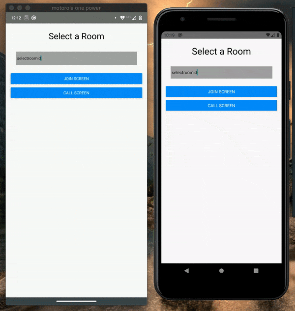

# react native web-rtc firebase

Minimal react native web-etc example with Firebase

## Demo

## Steps to setup the project

1. Clone the reposiotry `git clone https://github.com/DipanshKhandelwal/react-native-webrtc-firebase.git`

2. Create a new firebase project `https://console.firebase.google.com/`

3. Add new apps in the firebase console

4. Add firebase config to the apps.

    - For `Android`:
        - Download the `google-services.json` and add it to this path `android/app/`

    - For `ios`:
        - Download the `GoogleService-Info.plist` and add it to your ios project using `xcode`

5. In the `firebase console` remember to create a new `Firestore` database and keep it's rules to test mode.

6. Go to the project folder, and run the following command.

    - `yarn install`

7. Build the app:

    - For `Android`
        - `yarn run android`

    - For `ios`
        - `yarn run cocoapods`
        - `yarn run ios`

## Steps to run

Take a look at the demo for understanding the steps better.

- Enter Room Id.

- **Caller**

  - Call Screen
  - Start Call

- **Callee**

  - Join Screen
  - Join Call

- Stop Call
